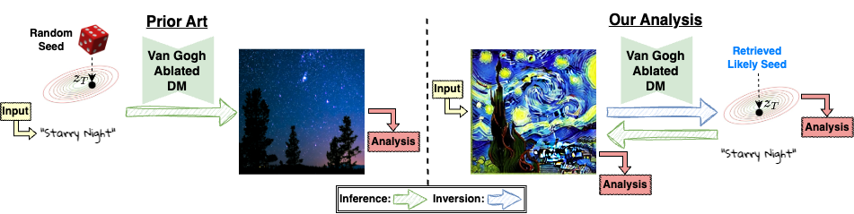

<h1 style="text-align: center;">
Memories of Forgotten Concepts
</h1>

<h3 style="text-align: center;">
<a href="https://scholar.google.com/citations?user=5TS4vucAAAAJ&hl=en&oi=ao">Matan Rusanovsky<sup>*</sup></a>,
<a href="https://www.malnick.net/in/shimon-malnick-1b8404125/">Shimon Malnick<sup>*</sup></a>,
<a href="https://scholar.google.com/citations?hl=en&user=czm6bkUAAAAJ">Amir Jevnisek<sup>*</sup></a>,
<a href="https://www.ohadf.com/"> Ohad Fried</a>,
<a href="http://www.eng.tau.ac.il/~avidan/"> Shai Avidan</a>
</h3>

<div style="text-align: center;">
    <h6><sup>*</sup>Equal Contribution</h6>
</div>

<h3 style="text-align: center;">
<a href="https://matanr.github.io/Memories_of_Forgotten_Concepts/">Project Page</a>
</h3>

<h3 style="text-align: center;">
<!-- add ref to arxiv below -->
<a href="">Arxiv</a>
</h3>



<div style="text-align: center;">
Official implementation of the paper:
 <a href=""> Memories of Forgotten Concepts</a>
<br>

</div>

# BibTex
```bib
```

# Getting Started
## Requirments:
1. Please download [mscoco17](https://cocodataset.org/#download).
2. Please download the ablated models (Links for [[Object](https://drive.google.com/file/d/1e5aX8gkC34YaHGR0S1-EQwBmUXiAPvpE/view), [Others](https://drive.google.com/file/d/1yeZNJ8MoHsisdZmt5lbnG_kSgl5xned0/view)]).
3. Please generate the datasets of the erased concepts using the appropriate csv file. For example, to generate the Nudity dataset:
```shell
cd Memories_of_Forgotten_Concepts
export CONCEPT=nudity
export PROMPT_FILE=./prompts/${CONCEPT}.csv
export SAVE_PATH=./datasets
mkdir -p $SAVE_PATH
python src/generate_dataset.py --prompts_path ${PROMPT_FILE} --concept ${CONCEPT} --save_path ${SAVE_PATH} --device cuda:0
```
4. Please download the [style classifier](https://drive.google.com/file/d/1me_MOrXip1Xa-XaUrPZZY7i49pgFe1po/view) for detection of the Van Gogh concept. Add an environemnt variable for the classifier:
```shell
export STYLE_CLASSIFIER_DIR=/path/to/cls/dir
```

## Setup Environment
### Conda + pip
create an environemnt using the supplied requirements.txt file:
```shell
git clone https://github.com/matanr/Memories_of_Forgotten_Concepts
cd Memories_of_Forgotten_Concepts/src
conda create -n mem python=3.10
conda activate mem
pip install -r requirements.txt
```

### [Docker Setup Information](docker/DOCKER-INFO.md)

## Running
Make sure the outputs directory contains the ``concept`` name in either configuration.
In addition, it is recommended to specify the model name and the experimental configuration.
For example, when running on ``ESD`` that erased the concept ``nudity``, in the ``concept-level`` configuration, set: 

```
<out directory>=memories_of_ESD_nudity
```
Similarly, in the `image-level`` configuration set:
```
<out directory>=many_memories_of_ESD_nudity
```
### Concept-Level
Perform a concept-level analysis (example for the 'Nudity' concept):

```shell
python memory_of_an_ablated_concept.py 
--reference_dataset_root <path to mscoco17>
--out_dir <out directory>
--ablated_concept_name <nudity/vangogh/church/garbage_truck/tench/parachute>
--dataset_root <path to the dataset of images of ablated_concept_name>
--diffusion_inversion_method <renoise/nti>
--num_diffusion_inversion_steps <default is 50>
--ablated_model <for all models except for AdvUnlearn include this parameter with the path to the ablated model, otherwise ignore this parameter>
--ablated_text_encoder <for AdvUnlearn include this parameter with: OPTML-Group/AdvUnlearn, otherwise ignore this parameter>
```

### Image-Level
Perform an image-level analysis:
```shell
python many_memories_of_an_ablated_image.py 
--reference_dataset_root <path to mscoco17>
--out_dir <out directory>
--ablated_concept_name <nudity/vangogh/church/garbage_truck/tench/parachute>
--dataset_root <path to the dataset of images of ablated_concept_name>
--num_vae_inversion_steps <default is 3000>
--diffusion_inversion_method <renoise/nti>
--num_diffusion_inversion_steps <default is 50>
--ablated_model <for all models except for AdvUnlearn include this parameter with the path to the ablated model, otherwise ignore this parameter>
--ablated_text_encoder <for AdvUnlearn include this parameter with: OPTML-Group/AdvUnlearn, otherwise ignore this parameter>
```

# BibTex
```bib
@misc{rusanovsky2024memoriesforgottenconcepts,
      title={Memories of Forgotten Concepts}, 
      author={Matan Rusanovsky and Shimon Malnick and Amir Jevnisek and Ohad Fried and Shai Avidan},
      year={2024},
      eprint={2412.00782},
      archivePrefix={arXiv},
      primaryClass={cs.CV},
      url={https://arxiv.org/abs/2412.00782}, 
}
```

# Acknowlegments
This repository is built upon and incorporates code from [Diffusion-MU-Attack](https://github.com/OPTML-Group/Diffusion-MU-Attack), [AdvUnlearn](https://github.com/OPTML-Group/AdvUnlearn) and [Renoise](https://github.com/garibida/ReNoise-Inversion).