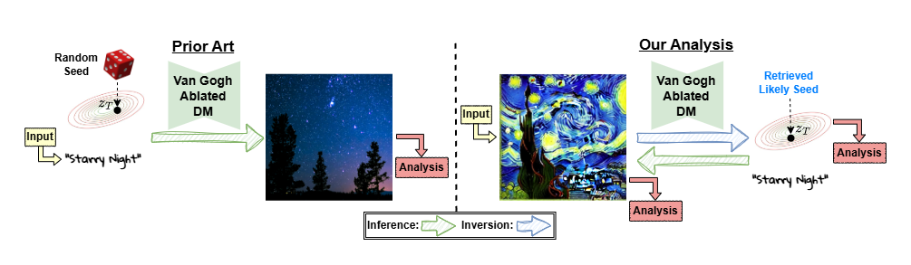

<h1 style="text-align: center;">
Memories of Forgotten Concepts
</h1>

<h3 style="text-align: center;">
<a href="https://scholar.google.com/citations?user=5TS4vucAAAAJ&hl=en&oi=ao">Matan Rusanovsky<sup>*</sup></a>,
<a href="https://www.malnick.net/in/shimon-malnick-1b8404125/">Shimon Malnick<sup>*</sup></a>,
<a href="https://scholar.google.com/citations?hl=en&user=czm6bkUAAAAJ">Amir Jevnisek<sup>*</sup></a>,
<a href="https://www.ohadf.com/"> Ohad Fried</a>,
<a href="http://www.eng.tau.ac.il/~avidan/"> Shai Avidan</a>
</h3>

<div style="text-align: center;">
    <h6><sup>*</sup>Equal Contribution</h6>
</div>

<h3 style="text-align: center;">
<a href="https://matanr.github.io/Memories_of_Forgotten_Concepts/">Project Page</a>
</h3>

<h3 style="text-align: center;">
<!-- add ref to arxiv below -->
<a href="">Arxiv</a>
</h3>



<div style="text-align: center;">
Official implementation of the paper:
 <a href=""> Memories of Forgotten Concepts</a>
<br>
The code will be uploaded soon.
</div>

# BibTex
```bib
```